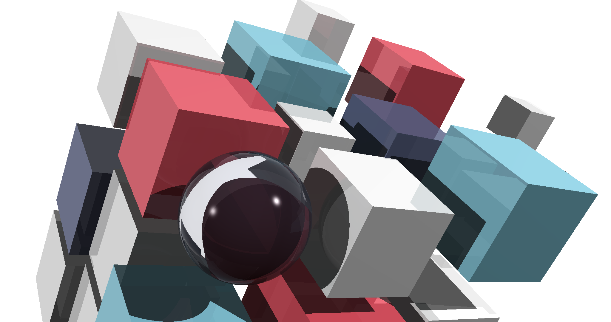
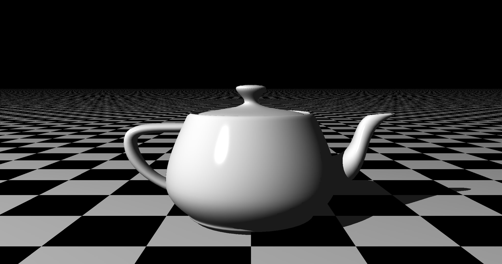
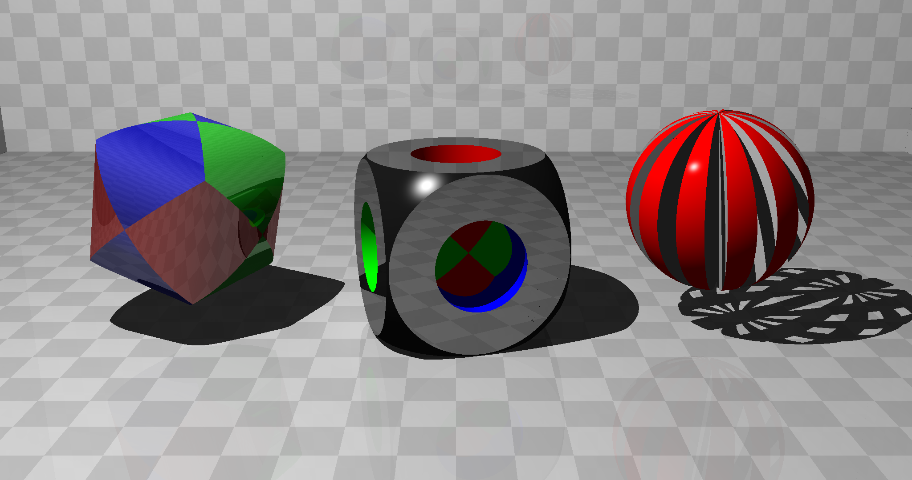
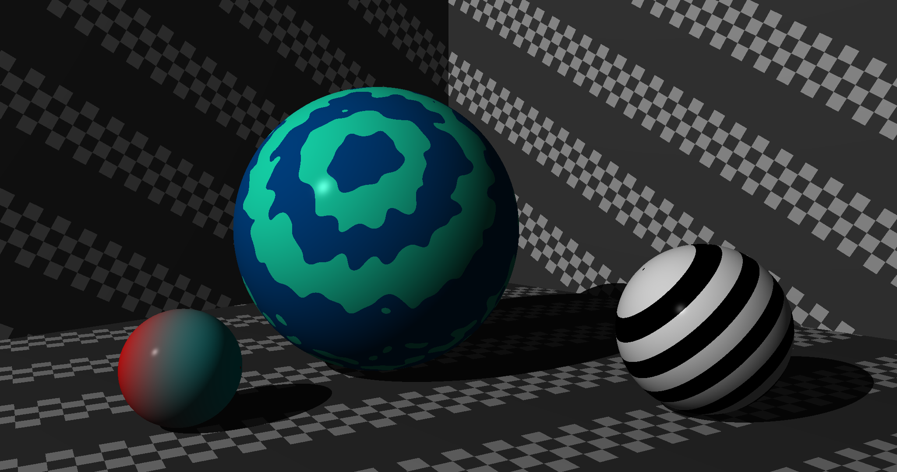
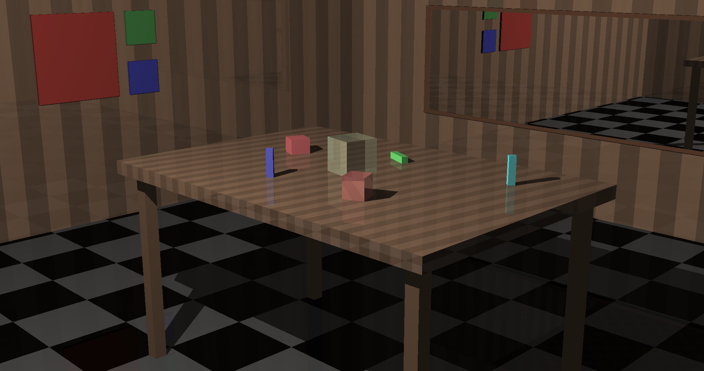
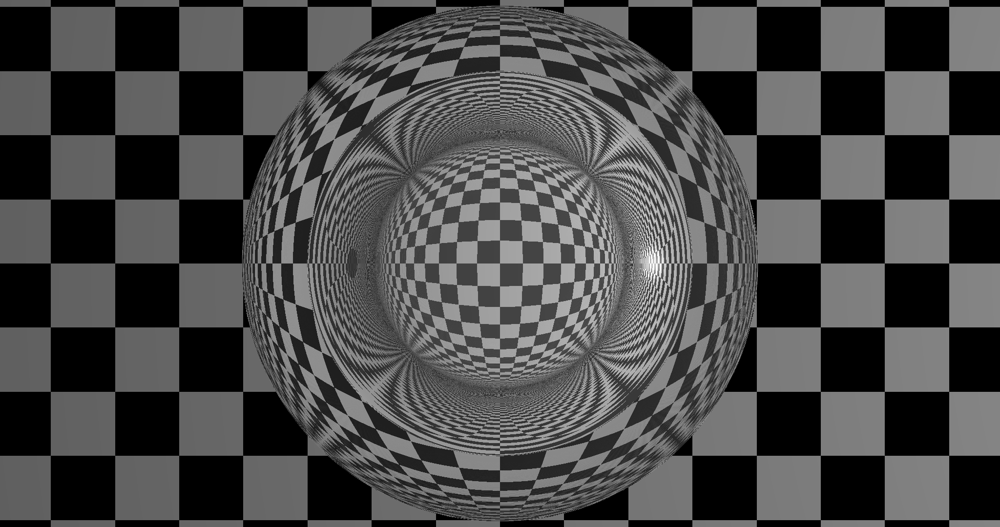

# The Ray Tracer Challenge

This is my implementation of the [Ray Tracer Challenge](http://raytracerchallenge.com/) in Rust! It has all the main features from chapters 1-16 and has a few extra features such as nested patterns and optimizations such as rendering in parallel and caching intermediate computations. Overall it was really fun and seems to run pretty decently, especially when compiling with AVX and FMA.

# Gallery

